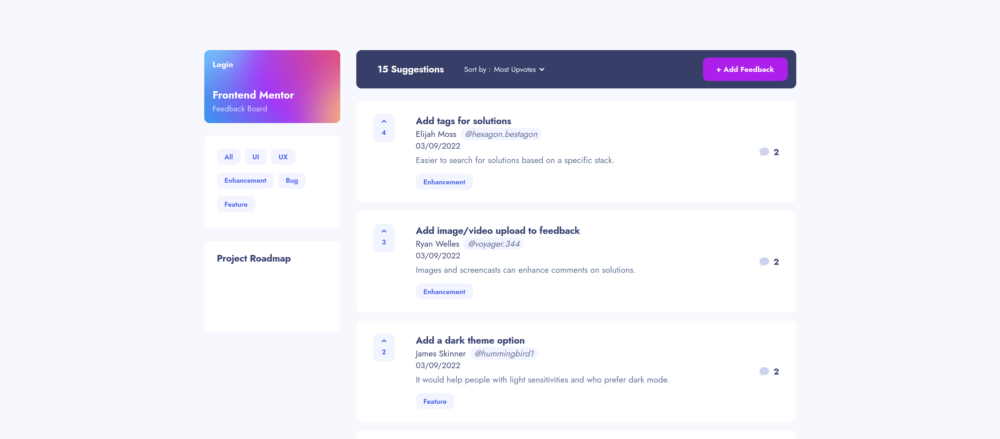

# Frontend Mentor - Product feedback app solution

This is a solution to the [Product feedback app challenge on Frontend Mentor](https://www.frontendmentor.io/challenges/product-feedback-app-wbvUYqjR6). Frontend Mentor challenges help you improve your coding skills by building realistic projects.

## Table of contents

- [Overview](#overview)
  - [The challenge](#the-challenge)
  - [Screenshot](#screenshot)
  - [Links](#links)
- [My process](#my-process)
  - [Built with](#built-with)
  - [What I learned](#what-i-learned)
  - [Useful resources](#useful-resources)
- [Author](#author)

**Note: Delete this note and update the table of contents based on what sections you keep.**

## Overview

### The challenge

Users should be able to:

- View the optimal layout for the app depending on their device's screen size :heavy_check_mark:
- See hover states for all interactive elements on the page :heavy_check_mark:
- Create and login to their account :heavy_check_mark:
- Create, read, update, and delete product feedback requests :heavy_check_mark:
- Sort suggestions by most/least upvotes and most/least comments :heavy_check_mark:
- Filter suggestions by category :heavy_check_mark:
- Upvote product feedback requests :heavy_check_mark:
- Receive form validations when trying to create/edit feedback requests :construction:
- Add comments and replies to a product feedback request :construction:
- Add transitions and animations to the web application :construction:

### Screenshot

### Links

- Solution URL: -------
- Live Site URL: [https://product-suggestions-board.netlify.app/](https://product-suggestions-board.netlify.app/)

## My process

### Built with

- Semantic HTML5 markup
- Component-Scoped Styles with CSS Modules
- Flexbox
- Mobile-first workflow
- [React](https://reactjs.org/) - JS library
- [React Redux](https://react-redux.js.org/)
- [React Router](https://reactrouter.com/)
- [Node](https://nodejs.org/en/) - JS runtime environment
- [Express](https://expressjs.com/) - Node.js framework
- [MongoDB](https://www.mongodb.com/) - NoSQL database program

### What I learned

- **React Redux is awesome** - I enjoy the seperation of actions and reducers. I feel as is Redux is very scalable for larger projects, so I may continue to use it even in my smaller projects. I know there is a lot of discussion between using Redux and using the Context API; I will eventually try out the Context API before making any comments on which is better.

- **Express and Mongoose** - Since I have prior experience with creating RESTful APIs, I had little to no issues when learning and implementing my backend using these frameworks. Mongoose made it very easy to communicate between the server and the MongoDB database. Moving forward with full stack application development, I believe it is a no brainer using these two frameworks for my back end.

### Useful resources

- [React Redux Crash Course](https://www.youtube.com/watch?v=9jULHSe41ls)
- [Mongoose Docs](https://mongoosejs.com/docs/)

## Author

- Frontend Mentor - [@tkressma](https://www.frontendmentor.io/profile/tkressma)
- Twitter - [@tom_kressman](https://www.twitter.com/tom_kressman)
